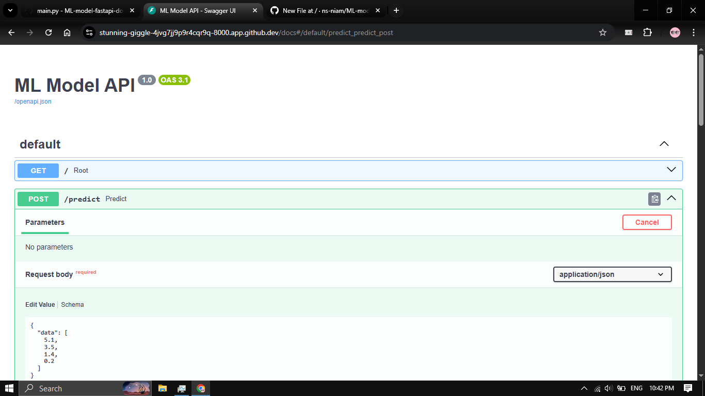
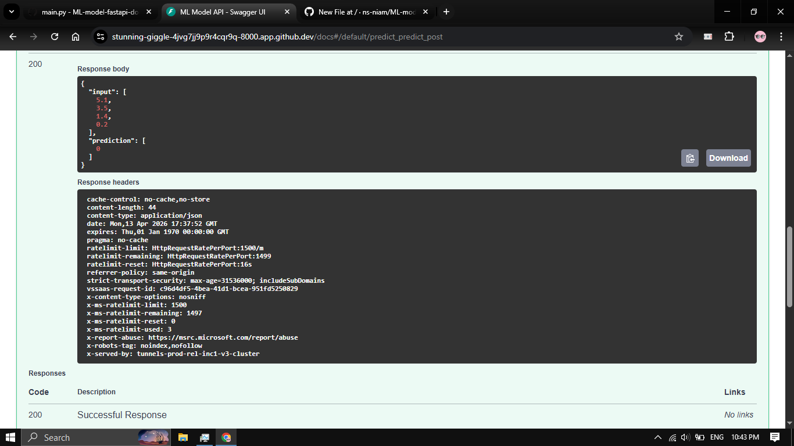

#  ML Model Deployment with FastAPI & Docker

## 📌 Overview

This project demonstrates how to train a Machine Learning classification model and deploy it as a RESTful API using FastAPI. The application is containerized using Docker to ensure consistent and reproducible deployment across different environments.

---

## ⚙️ Features

* ✅ Train a Machine Learning model using Scikit-learn
* ✅ Serve predictions via FastAPI REST API
* ✅ Interactive API documentation (Swagger UI)
* ✅ JSON-based request handling using Pydantic
* ✅ Docker containerization for portability
* ✅ Clean and modular project structure

---

## 🧠 Machine Learning Model

* Dataset: Iris Dataset
* Algorithm: Random Forest Classifier
* Library: Scikit-learn

---

## 📁 Project Structure

```
ml-fastapi-docker/
│
├── main.py            # FastAPI application
├── train.py           # Model training script
├── model.joblib       # Saved ML model
├── requirements.txt   # Dependencies
├── Dockerfile         # Docker configuration
├── .gitignore         # Ignored files
└── README.md          # Project documentation
```

---

## ▶️ Run Locally

### 1️⃣ Install dependencies

```
pip install -r requirements.txt
```

### 2️⃣ Run the API

```
uvicorn main:app --reload
```

### 3️⃣ Open in browser

```
http://127.0.0.1:8000/docs
```

---

## 🐳 Run with Docker

### 1️⃣ Build Docker image

```
docker build -t ml-api .
```

### 2️⃣ Run container

```
docker run -p 8000:8000 ml-api
```

### 3️⃣ Access API

```
http://localhost:8000/docs
```

---

## 🔗 API Endpoints

### 🔹 GET /

Check if API is running

**Response:**

```
{
  "message": "ML API is running successfully "
}
```

---

### 🔹 POST /predict

**Request Body:**

```
{
  "data": [5.1, 3.5, 1.4, 0.2]
}
```

**Response:**

```
{
  "input": [5.1, 3.5, 1.4, 0.2],
  "prediction": [0]
}
```

---

## 📸 Screenshots

### 🔹 API Documentation



### 🔹 Prediction Output



---

## 📖 Technologies Used

* Python
* FastAPI
* Scikit-learn
* Docker
* Uvicorn

---

## 💡 Key Concepts

* Machine Learning Model Deployment
* REST API Development
* Containerization with Docker
* API Testing using Swagger UI

---

## 👨‍💻 Author

**Niam** 
AI Engineering Student

---

## ⭐ Conclusion

This project demonstrates a complete workflow from training a machine learning model to deploying it as a production-ready API using modern tools and best practices.
